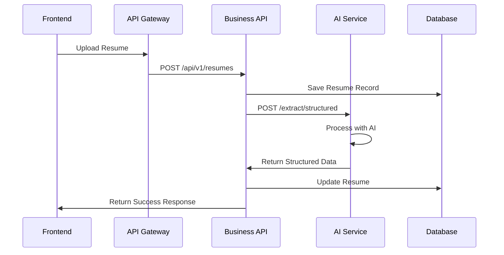

# 🚀 Microservices Migration Guide

This guide will help you migrate from your current Rails monolith to the microservices architecture.

## 📋 Migration Steps

### Phase 1: Setup AI Extraction Service

1. **Navigate to the AI service directory**:
   ```bash
   cd microservices/ai-extraction-service
   ```

2. **Install Python dependencies**:
   ```bash
   pip install -r requirements.txt
   ```

3. **Test the AI service**:
   ```bash
   python main.py
   # Service runs on http://localhost:8001
   ```

4. **Test AI endpoints**:
   ```bash
   curl http://localhost:8001/health
   curl http://localhost:8001/ai-providers
   ```

### Phase 2: Convert Rails to API-Only

1. **Copy your current Rails app to business-api**:
   ```bash
   cp -r ../../../!(microservices) microservices/business-api/
   ```

2. **Update `config/application.rb`**:
   ```ruby
   config.api_only = true
   ```

3. **Update Gemfile** - Remove view-related gems:
   ```ruby
   # Remove these gems:
   # gem "turbo-rails"
   # gem "stimulus-rails" 
   # gem "react-rails"
   # gem "jquery-rails"
   # gem "toastr-rails"
   # gem "sassc-rails"
   
   # Add API-specific gems:
   gem "rack-cors"
   gem "jwt"
   ```

4. **Update controllers** to inherit from `ActionController::API`:
   ```ruby
   class ApplicationController < ActionController::API
     # Remove view-related code
   end
   ```

5. **Create API routes** in `config/routes.rb`:
   ```ruby
   Rails.application.routes.draw do
     namespace :api do
       namespace :v1 do
         resources :resumes do
           member do
             post :process
             post :reprocess
           end
         end
         resources :job_descriptions
         resources :tenants
         
         # Auth routes
         post 'auth/login', to: 'authentication#login'
         post 'auth/logout', to: 'authentication#logout'
         get 'auth/profile', to: 'authentication#profile'
       end
     end
     
     # Health check
     get '/health', to: 'application#health'
   end
   ```

6. **Update job processor** to use AI service:
   ```ruby
   # Replace ProcessResumeJob with ProcessResumeWithAIServiceJob
   # (see business-api/ai_service_job_example.rb)
   ```

### Phase 3: Test Service Communication

1. **Start all services with Docker Compose**:
   ```bash
   cd microservices
   docker-compose up
   ```

2. **Verify services are running**:
   - AI Service: http://localhost:8001/health
   - Business API: http://localhost:3001/health  
   - API Gateway: http://localhost:8080/health

3. **Test AI extraction**:
   ```bash
   curl -X POST http://localhost:8001/extract/text \
        -F "file=@sample_resume.pdf"
   ```

4. **Test business API**:
   ```bash
   curl http://localhost:3001/api/v1/resumes \
        -H "Authorization: Bearer YOUR_TOKEN"
   ```

### Phase 4: Frontend Development

1. **Create React/Next.js frontend** (optional):
   ```bash
   cd microservices/frontend
   npx create-next-app@latest . --typescript --tailwind --eslint
   ```

2. **Configure API integration**:
   ```typescript
   // lib/api.ts
   const API_BASE_URL = process.env.NEXT_PUBLIC_API_URL || 'http://localhost:8080/api/v1';
   
   export const apiClient = {
     get: (endpoint: string) => fetch(`${API_BASE_URL}${endpoint}`),
     post: (endpoint: string, data: any) => fetch(`${API_BASE_URL}${endpoint}`, {
       method: 'POST',
       headers: { 'Content-Type': 'application/json' },
       body: JSON.stringify(data)
     })
   };
   ```

## 🔄 Service Communication Flow



## 🧪 Testing

### Test AI Service Independently:
```bash
cd microservices/ai-extraction-service
python -m pytest tests/
```

### Test Business API:
```bash
cd microservices/business-api
bundle exec rspec
```

### Integration Testing:
```bash
cd microservices
docker-compose up -d
# Run integration tests
docker-compose exec business-api bundle exec rspec spec/integration/
```

## 📊 Performance Comparison

| Aspect | Monolith | Microservices |
|--------|----------|---------------|
| **Deployment** | Single deploy | Independent deploys |
| **Scaling** | Scale entire app | Scale individual services |
| **Development** | Single codebase | Multiple repositories |
| **Technology** | Rails only | Rails + Python + React |
| **Failure Impact** | Entire app down | Service isolation |

## 🚨 Common Issues & Solutions

### Issue: Service Discovery
**Problem**: Services can't find each other
**Solution**: Use Docker network names (e.g., `ai-extraction-service:8001`)

### Issue: CORS Errors
**Problem**: Frontend can't call APIs
**Solution**: Configure CORS in API Gateway nginx.conf

### Issue: File Upload Size
**Problem**: Large resume files fail
**Solution**: Increase `client_max_body_size` in nginx

### Issue: AI Service Timeout
**Problem**: AI processing takes too long
**Solution**: Increase proxy timeouts in nginx

## 🎯 Benefits Achieved

- ✅ **Independent Scaling**: Scale AI processing separately
- ✅ **Technology Choice**: Python for AI, Rails for business logic
- ✅ **Team Independence**: Frontend/backend/AI teams work separately
- ✅ **Fault Isolation**: AI service failure doesn't break entire app
- ✅ **Deployment Flexibility**: Deploy services independently

## 🔮 Next Steps

1. **Add Monitoring**: Implement Prometheus + Grafana
2. **Add Tracing**: Use Jaeger for distributed tracing
3. **Add Circuit Breakers**: Implement resilience patterns
4. **Add API Versioning**: Support multiple API versions
5. **Add Message Queues**: Use RabbitMQ for async communication

## 🆘 Rollback Plan

If needed, you can rollback to the monolith:
1. Stop microservices: `docker-compose down`
2. Start original Rails app: `rails server`
3. Update DNS/load balancer to point to monolith

Your original code is preserved and can be restored quickly!