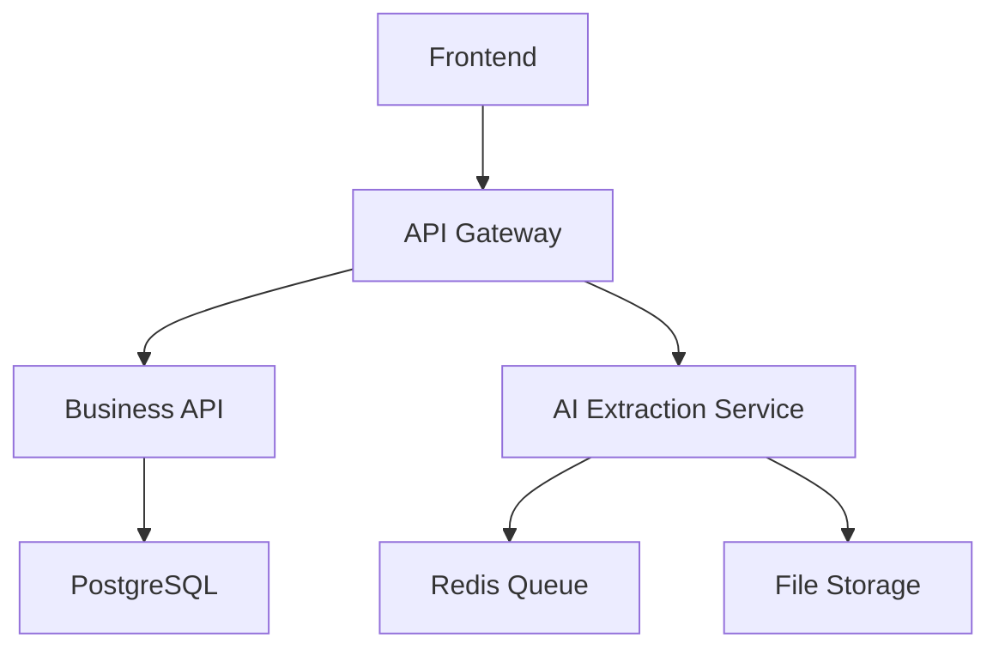

# AI Resume Parser - Microservices Architecture

## 🏗️ Architecture Overview

This document outlines the migration from a Rails monolith to a microservices architecture.

### **Services:**

1. **🤖 AI Extraction Service** (`ai-extraction-service/`)
   - **Technology**: Python + FastAPI
   - **Purpose**: PDF/DOCX parsing, AI processing, content enhancement
   - **Port**: 8001

2. **📊 Business Logic API** (`business-api/`)
   - **Technology**: Rails API-only
   - **Purpose**: User management, multi-tenancy, data persistence
   - **Port**: 3001

3. **🎨 Frontend Service** (`frontend/`)
   - **Technology**: React + Next.js
   - **Purpose**: User interface, file uploads, dashboard
   - **Port**: 3000

4. **🔌 API Gateway** (`api-gateway/`)
   - **Technology**: Nginx or Node.js Express
   - **Purpose**: Request routing, authentication, load balancing
   - **Port**: 8080

### **Shared Infrastructure:**
- **Database**: PostgreSQL (shared or per-service)
- **Cache/Queue**: Redis
- **File Storage**: MinIO or AWS S3
- **Service Discovery**: Consul or built-in Docker networking

## 🚀 Migration Strategy

### Phase 1: Extract AI Service (Current)
1. Create Python FastAPI service
2. Move `ResumeParsingService` logic
3. Implement async processing
4. Test service isolation

### Phase 2: Refactor Rails API
1. Convert Rails to API-only mode
2. Remove AI processing logic
3. Create service-to-service communication
4. Maintain multi-tenancy

### Phase 3: Frontend Separation
1. Create React/Next.js app
2. Implement API integration
3. Migrate UI components
4. Handle authentication

### Phase 4: Production Deployment
1. Container orchestration
2. Service monitoring
3. API gateway setup
4. Database optimization

## 📁 Directory Structure

```
microservices/
├── ai-extraction-service/     # Python FastAPI service
├── business-api/              # Rails API-only service
├── frontend/                  # React/Next.js application
├── api-gateway/               # Request routing
├── shared/                    # Shared utilities and configs
├── docker-compose.yml         # Development setup
├── docker-compose.prod.yml    # Production setup
└── README.md                  # This file
```

## 🔄 Service Communication



## 🛠️ Development Commands

```bash
# Start all services
docker-compose up

# Start specific service
docker-compose up ai-extraction-service

# View logs
docker-compose logs -f business-api

# Rebuild service
docker-compose up --build frontend
```

## 📊 Service Responsibilities

| Service | Authentication | File Processing | Data Persistence | Multi-tenancy |
|---------|---------------|-----------------|------------------|---------------|
| Frontend | ❌ | ✅ Upload | ❌ | ✅ Routing |
| Business API | ✅ | ❌ | ✅ | ✅ |
| AI Service | ❌ | ✅ Processing | ❌ | ❌ |
| API Gateway | ✅ Middleware | ❌ | ❌ | ✅ Routing |

## 🎯 Benefits

- **Scalability**: Scale AI processing independently
- **Technology Choice**: Best tool for each job
- **Development Velocity**: Teams can work independently
- **Deployment**: Deploy services separately
- **Resilience**: Service isolation prevents cascading failures

## 🚨 Considerations

- **Complexity**: More moving parts
- **Network Latency**: Service-to-service calls
- **Data Consistency**: Distributed transactions
- **Monitoring**: Need comprehensive observability